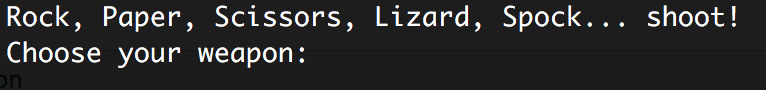
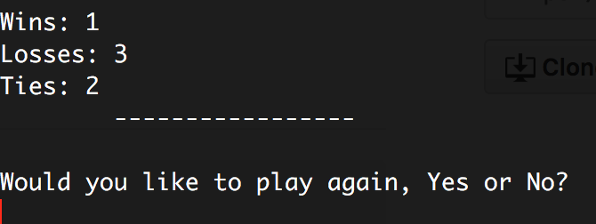

# Rock, Paper, Scissors, Lizard, Spock

A variation of Rock, Paper, Scissors, the game we all loved to play as kids. This was an exercise in trying to teach myself Java. It is a simple game that is ran in the terminal.

> Sheldon from Big Bang Theory to explain the rules [here](https://www.youtube.com/watch?v=iapcKVn7DdY)

## How to set up the game

If you do not have the Java SDK already downloaded, then you can get it [here](http://www.oracle.com/technetwork/java/javase/downloads/jdk8-downloads-2133151.html). Make sure you download the proper SDK for your operating system.

1. Fork this repository
2. Open your terminal and `cd` into the directory you want to clone the repository.
3. In your terminal clone down the repository:
  * `git clone https://github.com/YOURUSERNAME/rock-paper-scissors-lizard-spock.git`
4. Move into the new directory: `cd/rock-paper-scissors-lizard-spock`
5. Now we have to compile the Java files to be able to run the game.
  * In your terminal run `javac GameModel.java`
  * Then run `javac Main.java`

## Playing the game

1. Now run `java Main` in your terminal to initiate the game.
2. You should receive a prompt that looks like this:

 

3. To choose your weapon type `rock`, `paper`, `scissors`, `lizard`, or `spock`.
  * It is not case sensitive so don't worry about capitalization.
  * If you misspell your weapon, it will result in a tie.
4. Game will continue to play until you or the computer reaches 3 wins. Then you will be asked to if you'd like to play again:

  
  * Typing `Yes` will initiate a new game, `No` will take you out of the game.

## Next Steps

1. Incorporate spell checking so it prompts to enter a proper weapon and not default to a Tie.
2. Set up the game to be able to integrate a front-end to have a live site for someone to play the game.
3. Add the ability to have two human players play against each other.
